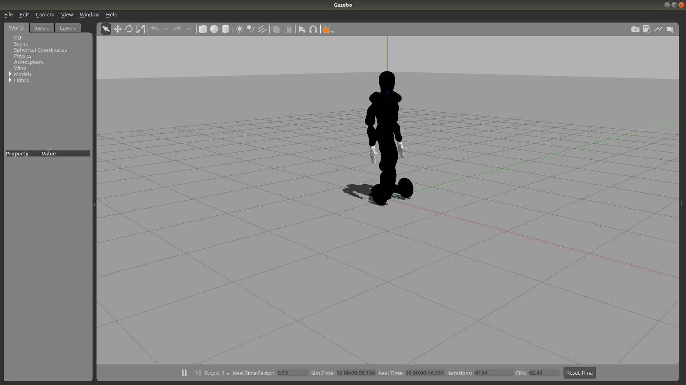

# EVE Gazebo Simulation Workspace Setup
Instructions maintained by: will@halodi.com



Prerequisites:
* Ubuntu 18.04
* A machine with graphics acceleration capability
* Access to private Halodi repositories. E-mail support@halodi.com or your sales rep to request this.
* (Recommended) An ssh-key for your Github account on your machine to make using vcs-tool easy. If you haven't set one up, see [these instructions](https://help.github.com/en/github/authenticating-to-github/generating-a-new-ssh-key-and-adding-it-to-the-ssh-agent)

The following steps describe the process for setting up your ROS 2 workspace to
develop with the EVE Gazebo simulation.

1. Install [ROS 2 - Eloquent](https://index.ros.org/doc/ros2/Installation/Eloquent/)
2. Install the following:
  ```bash
  sudo apt update
  sudo apt install git python3-colcon-common-extensions python3-vcstool swig3.0 xsltproc ros-eloquent-gazebo-ros-pkgs
  ```
3. Create ROS 2 a workspace:
  ```bash
  mkdir -p ~/eve_ws/src
  cd ~/eve_ws/src
  ```
4. In your workspace src directory, clone this repository and import the other required repos with vcs-tool
  ```bash
  git clone https://github.com/Halodi/halodi-controller-simulation-api.git
  vcs import < ./halodi-controller-simulation-api/eve_ws_https.repos
  ```
  OR (If you use ssh-keys with your GitHub account)
  ```bash
  git clone git@github.com:Halodi/halodi-controller-simulation-api.git
  vcs import < ./halodi-controller-simulation-api/eve_ws.repos
  ```
5. Download the the lastest ROS2 Workspace EVE controller [here](https://github.com/Halodi/halodi-controller-build-system/releases/download/v0.2.0-ROS2/halodi-controller-linux64-0.1.0.tar.gz) to your Downloads folder. If you get a 404 error on Github, it's more likely you haven't been given repo access yet. Request it: support@halodi.com
6. Extract it to your workspace:
  ```bash
  cd ~/eve_ws/src
  tar -xzf ~/Downloads/halodi-controller-linux64-0.1.0.tar.gz
  ````
7. Build and source the workspace:
  ```bash
  cd ~/eve_ws
  colcon build
  . install/setup.bash
  ```
8. Launch the EVE Gazebo sim:
```bash
ros2 launch halodi-controller-gazebo halodi-controller-gazebo.launch.py
```
